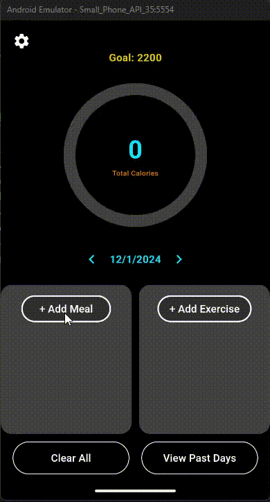

## Demo



---

## Getting Started

### Prerequisites

- [Flutter SDK](https://flutter.dev/docs/get-started/install)
- [Dart SDK](https://dart.dev/get-dart)
- [VS Code](https://code.visualstudio.com/) with the Flutter and Dart extensions
- An Android or iOS emulator, or a physical device

### Setup

1. **Clone the repository:**
   ```powershell
   git clone https://github.com/Faraj-Mustafa/mobile_dev_project.git
   cd mobile_dev_project
   ```

2. **Install dependencies:**
   ```powershell
   flutter pub get
   ```

3. **Configure Firebase:**
   - Make sure `google-services.json` (Android) and `GoogleService-Info.plist` (iOS) are in the correct directories (`android/app/` and `ios/Runner/`).

4. **Run the app:**
   - Open the project in VS Code.
   - Go to the top menu bar, select **View** → **Command Palette...** → type and select **Flutter: Launch Emulator** to start an emulator.
   - Once the emulator is running, press `F5` or run:
     ```powershell
     flutter run
     ```

### Notes

- Android Studio is not required; you can use VS Code for all development and testing.
- The app will request notification permissions on startup.
- Ensure your emulator or device has Google Play Services (for Android) or is properly configured for Firebase (for iOS).